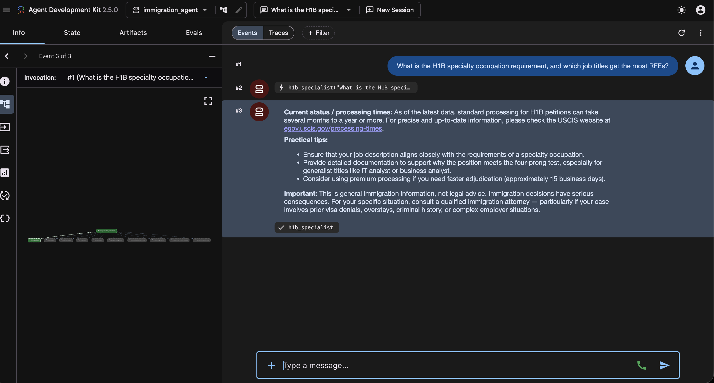

# immigration-assistant

A US immigration Q&A agent covering H1B, F1, B1/B2, L1, EB1, EB2, and EB3.
For every question it separates **what the law says** from **what tends to
happen in practice** — enforcement and officer discretion often diverge from
the letter of the law, so answers draw on documented real-world cases
(attorney advisories, community reports) alongside official sources, with
each clearly labeled.

Runs entirely on local open-source models via Ollama — no paid LLM APIs.

## Setup

1. Install Ollama and pull the model:
   ```
   bash scripts/pull_models.sh
   ```

2. Create a virtualenv and install dependencies:
   ```
   python3 -m venv .venv
   source .venv/bin/activate
   pip install -r requirements.txt
   ```

3. Configure environment:
   ```
   cp .env.example .env
   ```

4. Start Ollama in a separate terminal:
   ```
   ollama serve
   ```

5. Build the RAG knowledge index (run once, ~5 minutes):
   ```
   python scripts/build_index.py
   ```

6. Run the agent:
   ```
   adk run immigration_agent
   ```
   Or with the web UI:
   ```
   adk web
   ```

## Screenshots



## Disclaimer

This tool provides immigration information, not legal advice. Always
consult a qualified immigration attorney for your specific situation.
