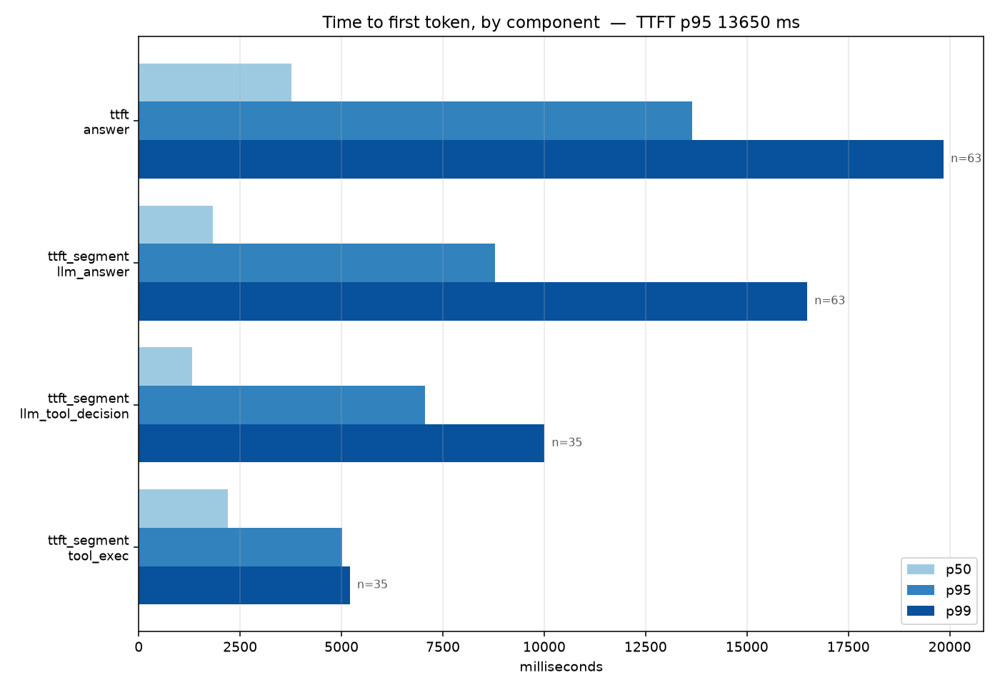

# Immigration Assistant

A voice assistant for US immigration questions — H-1B, F-1, B-1/B-2, L-1 and
employment-based green cards. You talk to it, it talks back.

What makes it different from a search box: it separates **what the law says**
from **what actually happens in practice**, and says so out loud when the two
diverge. That gap is usually the most useful part of the answer, and it's the
part you can't easily find alone at midnight.

**[Try it](https://immigration-assistant-karthik-s-projects-56f2.vercel.app)**
· [voice agent](voice/) · [evals](voice/evals/) · [prompts](voice/app/prompts/)

> Not legal advice. The agent hands off to an attorney for denials, removal
> proceedings, unlawful presence, criminal history, and anything touching
> misrepresentation.

---

## Where it stands

It works end to end and it is **not ready to ship**. Both are worth saying
plainly.

| | |
|---|---|
| Answer quality (held-out) | **1.86 / 3** |
| Cases passing the bar | **41%** |
| **Unsafe answers** | **23%** |
| Time to first token | **1.6s** without search, **7.6s** with |

The unsafe rate is the blocker. In this domain a missing "go see a lawyer" on
a removal question isn't a quality issue, it's the whole risk. The evals exist
to make that number visible rather than to flatter it.

## What measuring it actually found

Every one of these came from instrumentation, not intuition. Several were the
opposite of what I'd assumed.

**Tool calls were 20x slower than they needed to be.** Not the search
providers — Tavily answers in 69ms warm. Every call was building a new HTTP
client and paying fresh TLS handshakes to three providers. Pooling the
connection took search from 3136ms to 147ms.

**Long context wasn't the latency problem.** The obvious suspect was the
~2000-token system prompt. A/B'd it: more context was *faster*. The real cost
is Gemini's internal thinking before the first token — disabling it drops TTFT
from 875ms to 341ms, though that's a trade against reasoning quality on a
legal-adjacent agent, so it stays on.

**Longer answers are nearly free.** Against total response time, output tokens
looked dominant (r = +0.77). Against time-to-first-token they're +0.26, and
only on the tail — after the user is already hearing speech. The first
measurement was measuring answer length and calling it lag.

**The agent was citing a CBP hiring video as H-1B policy.** Search relevance
scores were being discarded. Off-topic results scored 0.02–0.09, correct ones
0.73–0.90. Nothing separated them.

**Searching many domains at once destroys relevance.** Across 24 official
domains the best result scored 0.094. Against `uscis.gov` alone, the right
page scored 0.904. Same query.

**A 2017 USCIS announcement outranked a current law-firm page**, purely for
being on a .gov domain. Archived pages now lose a trust tier.

## What a turn looks like in the logs

Every user turn gets a request id. Filter on it and you get the whole turn.

```
req=8f2a1c4d9e01 | event=user_query text='my H-1B employer is laying me off'
req=8f2a1c4d9e01 | event=tool_call name=search_official_guidance
req=8f2a1c4d9e01 | stage=ttft_segment name=tool_exec ms=147 hits=4
req=8f2a1c4d9e01 | event=tool_result summary={"count": 4}
req=8f2a1c4d9e01 | stage=ttft name=answer ms=2380 tool_calls=1
req=8f2a1c4d9e01 | event=agent_response chars=612
```

A slow or wrong answer in production is otherwise unattributable. You can see
that it was bad; you can't see why.

## Speed



Latency here means **time to first token** — when the user hears something.
Total response time is experienced as answer length, not lag, because audio
streams as it's produced.

| Segment | mean | share |
|---|---|---|
| Model decides to search | 2213 ms | 31% |
| Search runs | 2061 ms | 29% |
| Model starts answering | 2802 ms | 40% |

In voice, the filler audio fires the moment a search starts, so the user hears
*"let me check the current guidance on that"* at ~2s rather than silence until
7. That's what the pre-rendered clips are for — Gemini Live emits tool calls
silently, and no amount of prompting changes it. I tried three ways.

Biggest remaining win is not calling the tool at all: a cached knowledge layer
would move tool-using turns from 7.6s toward 1.6s.

```bash
uv run python scripts/latency_report.py
```

---

## How it's evaluated

49 cases, six factors each, scored 0–3 by `gemini-2.5-pro` — a different and
stronger model than the agent, which never sees an expected answer.

**21 cases are real questions from immigration forums.** Hand-written eval
questions measure what the author imagined users ask. Real ones carry the
actual phrasing: *"OPT (non-STEM) expired, in grace period, H1B selected. Do I
qualify for…"*

Only the *questions* come from forums. Rubrics are built from authoritative
sources retrieved through the agent's own search tool — grading against forum
answers would encode folklore as correctness. Nine harvested cases were
**excluded** because retrieval couldn't ground a rubric; they're in
`excluded.yaml` with reasons rather than quietly dropped.

**Safety is a gate, not an average.** Miss an attorney referral on a removal
question and the case fails, however articulate it was.

**Cases are split tune/holdout by stable hash.** Prompt changes only touch
`tune`. The headline number is `holdout`. Without that split an earlier
version scored 2.12; on unseen questions it was 1.68.

```bash
PYTHONPATH=. uv run python evals/run_eval.py --split holdout
PYTHONPATH=. uv run python evals/run_eval.py --no-tools   # degraded mode
```

### What the evals caught

- The agent said *"let me check the official guidance"* and then **never
  searched and never answered** — on the most safety-critical case in the set,
  about being told to misrepresent intent at the border.
- It recited a **stale $460 filing fee** as current. Someone would write that
  cheque.
- Fixing both moved honesty and safety from 1.75 to 2.50 on tune — and **moved
  holdout not at all**. That's the split doing its job: the fix was partly
  fitting, and a tune-only report would have read as a clean win.

## Architecture

```
Browser (Next.js, Vercel)
   │  WebSocket, protobuf audio
   ▼
Voice agent (Cloud Run, Pipecat)
   ├── Gemini Live via Vertex AI — speech in, speech out
   ├── Session state in memory, dropped on disconnect
   └── Tools, tiered by latency budget
```

**WebSocket, not WebRTC.** Cloud Run supports no UDP, so a WebRTC media path
can never establish there. Easy to miss, because signalling is plain HTTP and
succeeds — ICE just sits at `checking` and the client looks like it's
connecting slowly.

**Vertex AI, not AI Studio.** Google Cloud credits apply to Vertex but not to
AI Studio keys, which bill a card instead.

**Nothing is stored.** Session state dies with the connection; the browser
keeps its own transcript. For this audience that's a feature, not just a cost
decision.

| Piece | Job |
|---|---|
| Gemini Live (Vertex) | Native speech-to-speech, no separate STT/TTS |
| Pipecat | Audio pipeline, turn detection, tool dispatch, RTVI |
| Silero VAD + Smart Turn v3 | On-device turn detection, so a thinking pause isn't mistaken for a finished sentence |
| Tavily / Exa | Official-source search; Exa finds current USCIS pages, Tavily is cheap and broad |
| Parallel | Community search — 10 relevant Reddit threads where Tavily gets 2 and Exa gets 0 |
| eCFR API | Primary regulation text with real citations, no key needed |

### Source trust

Everything retrieved is tiered before the model sees it.

| Tier | Handling |
|---|---|
| Government, eCFR, Federal Register | Stated as fact, with a date |
| AILA, Murthy, Fragomen, Boundless | Attributed, not asserted |
| Reddit, X, forums | Never fact — only "what people report" |
| Anything unrecognised | Treated as anecdotal. An unfamiliar blog isn't trustworthy just for not being Reddit |

Anecdotes get filtered before the model sees them: spam and hearsay scored
out, scraped page furniture dropped, and a pattern only called one when
**three independent** people report it — four posts by the same author is one
opinion. Stale *numbers* are rejected outright; undated *stories* are allowed
with the date flagged. A stale number is a false fact. An old story is still a
true story.

### Turn-taking

Never cutting someone off matters more here than almost anywhere. Most users
are non-native English speakers asking questions that affect their lives, and
they pause mid-sentence to find words. Three layers: Gemini's server VAD with
low end-sensitivity and a 1.5s silence window, a local ONNX turn model, and an
LLM classifier told to bias toward "incomplete" on trailing conjunctions and
dangling numbers.

## Layout

```
voice/app/prompts/         one file per task, composed at load
voice/evals/tasks/<task>/  mirrors it — cases.yaml + factors/*.md
```

Prompts are split by task because each is separately owned and separately
regressible. Editing anecdote handling shouldn't mean scrolling past
escalation rules. The composition was verified word-identical to the single
string it replaced, and tests assert every escalation trigger survives a
refactor.

Factor files exist because "groundedness" means different things for a CFR
citation and a forum post. Each task defines its own.

## Running it

Needs Python 3.12 — pipecat depends on `audioop`, gone in 3.13.

```bash
cd voice
cp .env.example .env        # set GOOGLE_CLOUD_PROJECT_ID
uv sync
uv run python -m app.server
uv run python scripts/check_handshake.py http://localhost:8080
```

That last one drives a real `client-ready` → `bot-ready` exchange. It exists
because an earlier check verified only connectivity, passed happily, and the
browser hung on "connecting" forever.

Push to `main` or `dev` and it deploys itself: tests gate the deploy, the new
revision is smoke-tested, auth is keyless via Workload Identity Federation.

## Known gaps

- **23% of held-out answers are unsafe.** Blocking. The escalation checklist
  still misses situations adjacent to its triggers — lapsed work
  authorisation, preconceived intent on a change of status.
- **Groundedness is weakest at 1.65.** The agent retrieves good sources then
  answers without attributing to them.
- **No cached knowledge layer.** eCFR ingestion exists; the Tier-0 pack that
  would let stable questions skip search entirely doesn't. Biggest single win
  available, for both quality and latency.
- **Reddit posts come back undated** from every provider tried. Reddit's own
  API 403s datacenter traffic.
- **The endpoint is unauthenticated.** Fine for testing. Before real users it
  needs rate limiting, or anyone with the URL spends the credits.
